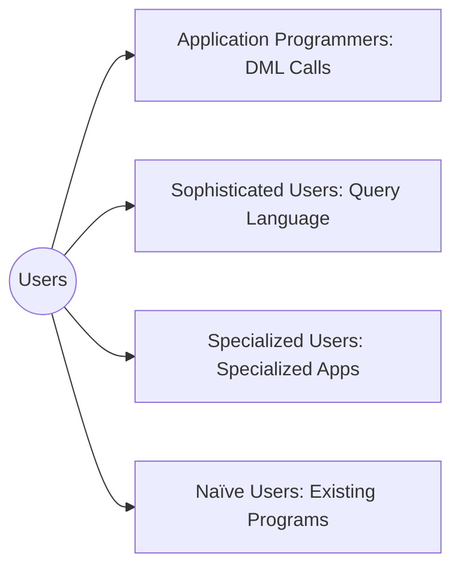
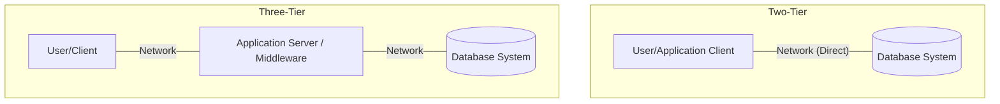
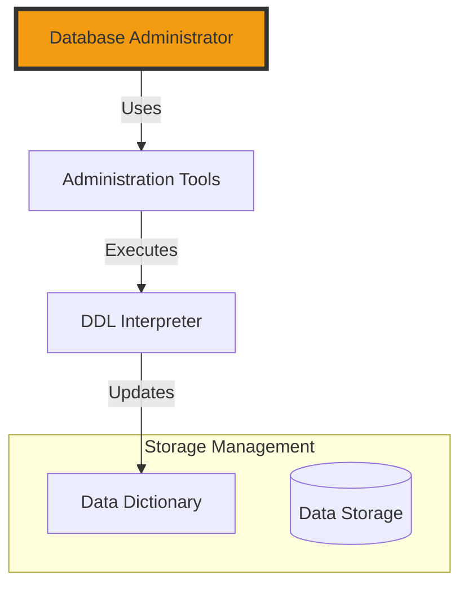
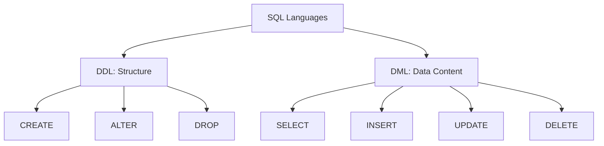
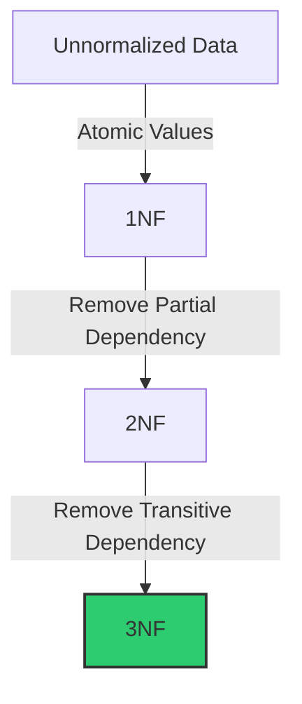
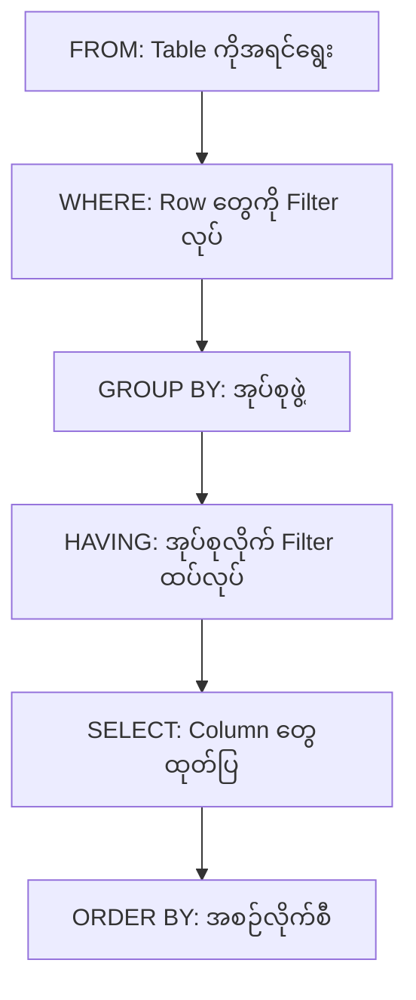

## [[What is a DBMS]]?

- **ဆက်စပ်နေသော အချက်အလက်များ စုစည်းမှု (Collection of interrelated data):** လက်ဖြင့် မှတ်တမ်းတင်ထားခြင်း (Manual)၊ ကွန်ပျူတာဖြင့် သိမ်းဆည်းခြင်း (Computerized) သို့မဟုတ် အွန်လိုင်း (Online) ပေါ်တွင် သိမ်းဆည်းထားခြင်း စသည့် နည်းလမ်းမျိုးစုံဖြင့် တစ်ခုနှင့်တစ်ခု ဆက်နွှယ်နေသော အချက်အလက်များကို စုစည်းထားခြင်း ဖြစ်သည်။
    
- **အချက်အလက်များကို ရယူအသုံးပြုနိုင်သည့် ပရိုဂရမ်များ (Set of programs to access the data):** သိမ်းဆည်းထားသော အချက်အလက်များကို လွယ်ကူစွာ ပြန်လည်ထုတ်ယူခြင်း၊ ပြင်ဆင်ခြင်းနှင့် စီမံခန့်ခွဲခြင်းတို့ ပြုလုပ်နိုင်ရန်အတွက် လိုအပ်သော ဆော့ဖ်ဝဲလ် (သို့မဟုတ်) ပရိုဂရမ်များ ပါဝင်သည်။
    
- **အဆင်ပြေပြီး ထိရောက်သော ပတ်ဝန်းကျင်ကို ဖန်တီးပေးခြင်း (Convenient and efficient environment):** DBMS သည် အသုံးပြုသူများအတွက် အချက်အလက်များကို အသုံးပြုရ လွယ်ကူစေရုံသာမက၊ အချိန်တိုအတွင်း ထိထိရောက်ရောက် လုပ်ဆောင်နိုင်သည့် လုပ်ငန်းခွင် ပတ်ဝန်းကျင်တစ်ခုကို ထောက်ပံ့ပေးသည်။

---
## [[Applications Areas of DBMS]]

ဒေတာဘေ့စ် စီမံခန့်ခွဲမှုစနစ် (DBMS) ကို အောက်ပါ နယ်ပယ်အသီးသီးတွင် အဓိက အသုံးပြုကြသည် -

- **ဘဏ်လုပ်ငန်း (Banking):** ငွေကြေးလွှဲပြောင်းမှုနှင့် လုပ်ဆောင်ချက်အားလုံး (Transactions) ကို မှတ်တမ်းတင် သိမ်းဆည်းရန် အသုံးပြုသည်။
    
- **လေကြောင်းလိုင်းများ (Airlines):** ခရီးစဉ် လက်မှတ်ဘိုကင်တင်ခြင်း (Reservations) နှင့် ခရီးစဉ် အချိန်ဇယားများ (Schedules) ကို စီမံခန့်ခွဲရန် အသုံးပြုသည်။
    
- **တက္ကသိုလ်များ (Universities):** ကျောင်းသား မှတ်ပုံတင်ခြင်း (Registration) နှင့် ရမှတ်/အမှတ်စာရင်းများ (Grades) ကို ထိန်းသိမ်းရန် အသုံးပြုသည်။
    
- **အရောင်းကဏ္ဍ (Sales):** ဝယ်ယူသူများ (Customers)၊ ကုန်ပစ္စည်းများ (Products) နှင့် ဝယ်ယူမှု မှတ်တမ်းများ (Purchases) ကို စနစ်တကျ သိမ်းဆည်းရန် အသုံးပြုသည်။
    
- **ကုန်ထုတ်လုပ်မှု (Manufacturing):** ထုတ်လုပ်မှု အဆင့်ဆင့် (Production)၊ ကုန်ပစ္စည်းလက်ကျန် (Inventory)၊ အမှာစာများ (Orders) နှင့် ထောက်ပံ့ရေးကွင်းဆက် (Supply chain) တို့တွင် အသုံးပြုသည်။
    
- **လူ့စွမ်းအားအရင်းအမြစ် (Human resources):** ဝန်ထမ်းမှတ်တမ်းများ (Employee records)၊ လစာများ (Salaries) နှင့် အခွန်နုတ်ယူမှုများ (Tax deductions) ကို စီမံခန့်ခွဲရန် အသုံးပြုသည်။
    

---
>[!TIP] **အနှစ်ချုပ်အနေဖြင့်:** ဒေတာဘေ့စ် (Databases) များသည် လူမှုဘဝ၏ ကဏ္ဍပေါင်းစုံတွင် ပါဝင်ပတ်သက် နေပါသည်။

---
## [[Why do we use DBMS]]?

အချက်အလက်တွေကို စနစ်တကျ ထိန်းသိမ်းဖို့နဲ့ ရှုပ်ထွေးမှုတွေကို လျှော့ချဖို့အတွက် **Database Management System (DBMS)** ကို အောက်ပါအကြောင်းပြချက်တွေကြောင့် အသုံးပြုကြပါတယ် -

### ၁။ အချက်အလက်များ ထပ်နေခြင်းနှင့် မကိုက်ညီခြင်းကို ရှောင်ရှားရန် (To avoid data redundancy and inconsistency)

- ဖိုင်အမျိုးအစား အမျိုးမျိုးဖြစ်နေတာမျိုးနဲ့ အချက်အလက်တွေက ဖိုင်အမျိုးမျိုးမှာ ထပ်နေတာမျိုးကို လျှော့ချပေးပါတယ်။
    
- Data တစ်နေရာမှာ ပြင်လိုက်ရင် ကျန်တဲ့နေရာတွေမှာပါ လိုက်ပြီး Update ဖြစ်စေတဲ့အတွက် အချက်အလက်တွေ တစ်ခုနဲ့တစ်ခု မကိုက်ညီတာမျိုး မဖြစ်အောင် ကာကွယ်ပေးပါတယ်။
    
### ၂။ အချက်အလက် ရှာဖွေရ ခက်ခဲမှုကို ဖြေရှင်းရန် (To avoid difficulty in accessing data)

- DBMS မရှိရင် လုပ်ဆောင်ချက်အသစ်တစ်ခု လုပ်တိုင်း (ဥပမာ- ရှာဖွေတာမျိုး) Program အသစ်တစ်ခု ထပ်ရေးနေရတတ်ပါတယ်။
    
- DBMS ကတော့ Query (ဥပမာ- SQL) အသုံးပြုပြီး အချက်အလက်တွေကို အလွယ်တကူ ထုတ်ယူနိုင်အောင် ကူညီပေးပါတယ်။
    

### ၃။ အချက်အလက်များ သီးခြားစီဖြစ်နေမှုကို ကိုင်တွယ်ရန် (To deal with data isolation)

- အချက်အလက်တွေက ဖိုင်အမျိုးမျိုး၊ Format အမျိုးမျိုးနဲ့ ကွဲပြားနေတဲ့အခါ ၎င်းတို့ကို စုစည်းပြီး အသုံးပြုရ ခက်ခဲတတ်ပါတယ်။ DBMS က ဒါတွေကို တစ်ပေါင်းတည်း ဖြစ်အောင် စီမံပေးပါတယ်။
    

### ၄။ တိကျခိုင်မာမှုဆိုင်ရာ ပြဿနာများကို ဖြေရှင်းရန် (To deal with integrity problems)

- **Integrity Constraints:** အချက်အလက်တွေမှာ ရှိရမယ့် ကန့်သတ်ချက်တွေကို သတ်မှတ်ပေးနိုင်ပါတယ်။
    
    - _ဥပမာ - ဘဏ်စာရင်းထဲက ငွေပမာဏဟာ ၀ ထက် နည်းလို့မရဘူး (Account Balance > 0) ဆိုတာမျိုး။_
        
- ဒီလို ကန့်သတ်ချက် (Constraints) အသစ်တွေ ထပ်ထည့်တာ ဒါမှမဟုတ် ရှိပြီးသားကို ပြင်ဆင်တာတွေကို Program Code ထဲမှာ လိုက်ပြင်နေစရာမလိုဘဲ DBMS ထဲမှာတင် လွယ်လွယ်ကူကူ လုပ်ဆောင်နိုင်ပါတယ်။

### ၅။ အချက်အလက်များ လုံခြုံမှုရှိစေရန် (To deal with security problems)

Database ထဲမှာရှိတဲ့ အချက်အလက်အားလုံးကို လူတိုင်း ကြည့်ခွင့်မရှိအောင် ကန့်သတ်ထားဖို့ လိုအပ်ပါတယ်။

- **Access Control:** ဘယ်သူက ဘယ် data ကို ကြည့်လို့ရတယ်၊ ဘယ်သူကတော့ ပြင်ဆင်ခွင့်ရှိတယ် ဆိုတာကို သတ်မှတ်ပေးနိုင်ပါတယ်။ (ဥပမာ - Payroll system တစ်ခုမှာ ဝန်ထမ်းက မိမိလစာကိုပဲ မြင်ရပြီး၊ HR ကသာ အားလုံးကို ပြင်ဆင်ခွင့်ရှိခြင်း)။
    

### ၆။ အသုံးပြုသူအများအပြား တစ်ပြိုင်နက်အသုံးပြုနိုင်ရန် (To deal with multi-user access)

စနစ်တစ်ခုကို လူအများကြီး တစ်ပြိုင်နက်တည်း အသုံးပြုတဲ့အခါ အချက်အလက်တွေ ရှုပ်ထွေးမသွားအောင် DBMS က ထိန်းကျောင်းပေးပါတယ်။

- **Concurrency Control:** လူနှစ်ယောက်က item တစ်ခုတည်းကို တစ်ချိန်တည်းမှာ ဝယ်ဖို့ ကြိုးစားတဲ့အခါမျိုးမှာ (ဥပမာ - လေယာဉ်လက်မှတ် အရောင်းစနစ်) အချက်အလက်တွေ မှားယွင်းမသွားအောင် စီမံပေးပါတယ်။

### ၇။ လုပ်ဆောင်ချက်များ အပြည့်အဝ ပြီးမြောက်စေခြင်း (Atomicity of updates)

စနစ်တစ်ခုမှာ အကြောင်းအမျိုးမျိုးကြောင့် (ဥပမာ - မီးပျက်ခြင်း၊ Software Error တက်ခြင်း) အချက်အလက် ပြင်ဆင်မှုတွေဟာ တစ်ဝက်တစ်ပျက်နဲ့ ရပ်တန့်သွားနိုင်ပါတယ်။ ၎င်းကို ဖြေရှင်းရန် DBMS က **Atomicity** ကို အသုံးပြုပါတယ်။

- **ပြဿနာ:** အချက်အလက်တွေကို တစ်ဝက်တစ်ပျက်ပဲ Update လုပ်မိရင် Database ရဲ့ အခြေအနေဟာ မမှန်မကန် (Inconsistent) ဖြစ်သွားနိုင်ပါတယ်။
    
- **ဥပမာ:** အကောင့်တစ်ခုမှ တစ်ခုသို့ ငွေလွှဲခြင်း (Transfer of funds)။
    
    - အကောင့် A မှ ငွေနှုတ်ပြီး၊ အကောင့် B ထဲ ငွေမရောက်ခင် စနစ်ချို့ယွင်းသွားရင် ငွေတွေ ပျောက်ဆုံးသွားပါလိမ့်မယ်။
        
- **ဖြေရှင်းချက်:** DBMS က "All or Nothing" မူဝါဒကို ကျင့်သုံးပါတယ်။ လုပ်ဆောင်ချက်တစ်ခုဟာ **အကုန်လုံး အောင်မြင်စွာ ပြီးမြောက်ရပါမယ်**၊ သို့မဟုတ်ပါက **လုံးဝ မလုပ်ဆောင်ခဲ့သလိုမျိုး** မူလအခြေအနေသို့ ပြန်သွားရပါမယ် (Rollback)။

ဒီအချက်တွေဟာ DBMS ရဲ့ နာမည်ကြီး **ACID** properties ထဲက အချက်တွေ ဖြစ်ပါတယ်။
## [[ACID Properties]] ဆိုတာဘာလဲ?

Database Transaction တစ်ခုကို ဆောင်ရွက်တဲ့အခါ အချက်အလက်တွေ မှန်ကန်တိကျမှု ရှိစေဖို့အတွက် အောက်ပါ အခြေခံစည်းမျဉ်း (၄) ခု လိုအပ်ပါတယ်။

#### ၁။ Atomicity (အကုန်လုံးဖြစ်စေ၊ လုံးဝမဖြစ်စေရ)

*Transaction တစ်ခုအတွင်းမှာ ပါဝင်တဲ့ အလုပ်တွေအားလုံးဟာ အောင်မြင်ရင် အကုန်အောင်မြင်ရမယ်၊ တစ်ခုခုချို့ယွင်းတာနဲ့ အကုန်လုံးကို ဖျက်သိမ်းပြီး မူလအခြေအနေ (Original State) ကို ပြန်သွားရမယ်ဆိုတဲ့ မူဝါဒပါ။*

- ***Key concept:** "All or Nothing"*
    

#### ၂။ Consistency (အမြဲတမ်း မှန်ကန်နေရမည်)

*Transaction တစ်ခု မလုပ်ဆောင်ခင်မှာ ရှိနေတဲ့ Database ရဲ့ စည်းမျဉ်းစည်းကမ်းတွေ (Constraints) ဟာ Transaction လုပ်ပြီးသွားတဲ့ အခါမှာလည်း ကိုက်ညီနေရပါမယ်။ အချက်အလက်တွေဟာ ပရမ်းပတာ မဖြစ်သွားစေရပါဘူး။*

- ***ဥပမာ:** ငွေလွှဲလိုက်သော်လည်း စုစုပေါင်း ငွေပမာဏဟာ ပြောင်းလဲမသွားခြင်း။*
    

#### ၃။ Isolation (သီးခြားစီဖြစ်နေရမည်)

*Transaction အများအပြား တစ်ပြိုင်နက် လုပ်ဆောင်နေတဲ့အခါ တစ်ခုနဲ့တစ်ခု နှောင့်ယှက်တာမျိုး မရှိစေရပါဘူး။ Transaction တစ်ခု ပြီးဆုံးမှသာ နောက်တစ်ခုက ၎င်းရဲ့ ရလဒ်ကို မြင်တွေ့ခွင့်ရှိမှာ ဖြစ်ပါတယ်။*

- ***Key concept:** လူအများကြီး သုံးနေပေမယ့် ကိုယ်တစ်ယောက်တည်း သုံးနေသလိုမျိုး သီးသန့်ဖြစ်နေခြင်း။*
    

#### ၄။ Durability (အမြဲတမ်း တည်မြဲနေရမည်)

*Transaction တစ်ခု အောင်မြင်စွာ ပြီးဆုံးသွားပြီ (Commit ဖြစ်သွားပြီ) ဆိုရင် အဲဒီအချက်အလက်ဟာ စနစ်ထဲမှာ အမြဲတမ်း ရှိနေရပါမယ်။ နောက်ပိုင်းမှာ မီးပျက်တာ ဒါမှမဟုတ် System Crash ဖြစ်တာမျိုး ကြုံရရင်တောင် အဲဒီ Data တွေဟာ ပျက်စီးမသွားဘဲ တည်မြဲနေရပါမယ်။*

### ၈။ အသုံးပြုသူအများအပြား တစ်ပြိုင်နက် အသုံးပြုနိုင်ခြင်း (Concurrent access by multiple users)

စနစ်တစ်ခုရဲ့ စွမ်းဆောင်ရည် (Performance) ကောင်းမွန်ဖို့အတွက် အသုံးပြုသူ အများအပြားကို တစ်ချိန်တည်းမှာ Database ကို ဝင်ရောက်ခွင့် ပေးထားရပါတယ်။

- **လိုအပ်ချက်:** လူအများကြီး တစ်ပြိုင်နက်သုံးနိုင်မှသာ အချိန်ကုန်သက်သာပြီး မြန်ဆန်မှာ ဖြစ်ပါတယ်။
    
- **ပြဿနာ:** အထိန်းအကွပ်မရှိဘဲ (Uncontrolled) တစ်ပြိုင်နက် အသုံးပြုခွင့်ပေးရင် အချက်အလက်တွေ မှားယွင်းကုန်ပါလိမ့်မယ်။
    
    - _ဥပမာ -_ လူနှစ်ယောက်က ဘဏ်အကောင့် တစ်ခုတည်းမှာရှိတဲ့ လက်ကျန်ငွေ (Balance) ကို တစ်ချိန်တည်းမှာ ကြည့်ပြီး ငွေထုတ်လိုက်ရင်၊ စနစ်က လက်ကျန်ငွေကို မှန်အောင် နှုတ်ပေးနိုင်မှာ မဟုတ်တော့ဘဲ Inconsistency ဖြစ်သွားပါလိမ့်မယ်။
        
- **ဖြေရှင်းချက်:** DBMS က Concurrency Control စနစ်ကို သုံးပြီး လူအများကြီး တစ်ချိန်တည်း သုံးနေပေမယ့် အချက်အလက်တွေ မှန်ကန်နေအောင် ထိန်းချုပ်ပေးပါတယ်။

---
# RDBMS ဆိုတာဘာလဲ? ([[What is RDBMS]]?)

**RDBMS** ရဲ့ အရှည်ကတော့ **Relational Database Management System** ဖြစ်ပါတယ်။ ၎င်းဟာ Relational Model (E.F. Codd မှ ၁၉၇၀ တွင် စတင်မိတ်ဆက်ခဲ့သည်) ကို အခြေခံပြီး တည်ဆောက်ထားတဲ့ Database စီမံခန့်ခွဲမှုစနစ် ဖြစ်ပါတယ်။

ယနေ့ခေတ်မှာ အသုံးအများဆုံး Database အမျိုးအစားဖြစ်ပြီး Microsoft SQL Server, Oracle, MySQL နဲ့ PostgreSQL တို့ဟာ RDBMS တွေ ဖြစ်ကြပါတယ်။

## ၁။ အဓိက အချက်များ (Key Characteristics)

- **Tabular Format:** အချက်အလက်များကို ဇယား (Table) ပုံစံဖြင့် သိမ်းဆည်းသည်။
    
- **Row/Column Structure:** Table များတွင် Columns (Fields) နှင့် Rows (Records/Tuples) များ ပါဝင်သည်။
    
- **Relationships:** Table တစ်ခုနှင့်တစ်ခုကြားတွင် **Primary Key** နှင့် **Foreign Key** များကို အသုံးပြု၍ ဆက်သွယ်ချက်များ (Relationships) တည်ဆောက်ထားသည်။
    
- **SQL Support:** အချက်အလက်များကို ရှာဖွေ၊ ပြင်ဆင်၊ ဖျက်သိမ်းရန်အတွက် **SQL** (Structured Query Language) ကို အသုံးပြုသည်။
    

---

## ၂။ RDBMS ၏ အခြေခံ အစိတ်အပိုင်းများ (RDBMS Components)

1. **Table:** အချက်အလက်များ သိမ်းဆည်းရာ အခြေခံ ယူနစ်။
    
2. **Field (Column):** အချက်အလက်၏ အမျိုးအစား သို့မဟုတ် ဂုဏ်သတ္တိ (ဥပမာ- Name, Age)။
    
3. **Record (Row):** အချက်အလက် တစ်စုံ (ဥပမာ- ဝန်ထမ်းတစ်ဦးချင်းစီ၏ ကိုယ်ရေးအချက်အလက်)။
    
4. **Primary Key:** Table တစ်ခုအတွင်းရှိ Row တစ်ခုစီကို ထူးခြားစွာ ခွဲခြားနိုင်သော Key (ဥပမာ- Student ID)။
    
5. **Foreign Key:** Table နှစ်ခုကြား ဆက်သွယ်မှု တည်ဆောက်ရန် အသုံးပြုသော Key။


## ၃။ DBMS နှင့် RDBMS ကွာခြားချက် (DBMS vs RDBMS)

|**Feature**|**DBMS**|**RDBMS**|
|---|---|---|
|**Data Storage**|ဖိုင်ပုံစံ (File System) ဖြင့် သိမ်းသည်။|ဇယား (Table) ပုံစံဖြင့် သိမ်းသည်။|
|**Relationship**|Table များကြား ဆက်သွယ်ချက် မရှိပါ။|Table များကြား ဆက်သွယ်ချက် ရှိသည်။|
|**Data Redundancy**|အချက်အလက် ထပ်နေခြင်း (Redundancy) များသည်။|Normalization ကြောင့် Data ထပ်နေခြင်း နည်းသည်။|
|**Security**|လုံခြုံရေး အားနည်းသည်။|လုံခြုံရေး အလွန်ကောင်းမွန်သည်။|
|**Users**|Single User သာ အသုံးများသည်။|Multi-users တစ်ပြိုင်နက် သုံးနိုင်သည်။|

## ၄။ နာမည်ကြီး RDBMS Software များ

- **Open Source:** MySQL, PostgreSQL, MariaDB, SQLite.
    
- **Commercial (Paid):** Oracle Database, Microsoft SQL Server, IBM DB2.

## [[Database Relationships]] (ဆက်သွယ်ချက် အမျိုးအစားများ)

Table တွေကြားမှာ ဆက်သွယ်ချက် တည်ဆောက်ဖို့အတွက် **Primary Key** (ဇယားတစ်ခုရဲ့ အဓိက Key) နဲ့ **Foreign Key** (အခြားဇယားကို သွားချိတ်တဲ့ Key) တို့ကို အသုံးပြုပါတယ်။

### ၁။ One-to-One (1:1)

ဇယား A က အချက်အလက်တစ်ခုဟာ ဇယား B က အချက်အလက်တစ်ခုတည်းနဲ့ပဲ သက်ဆိုင်တဲ့အခါမျိုးပါ။

- **ဥပမာ:** လူတစ်ယောက် (Person) မှာ နိုင်ငံသားစိစစ်ရေးကတ် (ID Card) တစ်ခုပဲ ရှိနိုင်သလို၊ ID Card တစ်ခုဟာလည်း လူတစ်ယောက်တည်းအတွက်ပဲ ဖြစ်ရပါမယ်။
    

### ၂။ One-to-Many (1:N) - အသုံးအများဆုံး

ဇယား A က အချက်အလက်တစ်ခုဟာ ဇယား B က အချက်အလက်အများကြီးနဲ့ သက်ဆိုင်နိုင်ပေမယ့်၊ ဇယား B က အချက်အလက်တစ်ခုဟာ ဇယား A က အချက်အလက်တစ်ခုတည်းနဲ့ပဲ သက်ဆိုင်တာမျိုးပါ။

- **ဥပမာ:** ဝန်ထမ်းဌာနတစ်ခု (Department) မှာ ဝန်ထမ်း (Employees) အများကြီး ရှိနိုင်ပါတယ်။ ဒါပေမယ့် ဝန်ထမ်းတစ်ယောက်ဟာ ဌာနတစ်ခုတည်းမှာပဲ အလုပ်လုပ်ရပါမယ်။
    
- **မှတ်ချက်:** ဒါကို RDBMS မှာ Foreign Key သုံးပြီး အဓိက ချိတ်ဆက်လေ့ရှိပါတယ်။
    

### ၃။ Many-to-Many (M:N)

ဇယား A က အချက်အလက်တစ်ခုဟာ ဇယား B က အချက်အလက်အများကြီးနဲ့ သက်ဆိုင်နိုင်သလို၊ ဇယား B က တစ်ခုဟာလည်း ဇယား A က အများကြီးနဲ့ ပြန်ပြီး သက်ဆိုင်နေတာမျိုးပါ။

- **ဥပမာ:** ကျောင်းသားတစ်ယောက် (Student) ဟာ ဘာသာရပ် (Courses) အများကြီး တက်နိုင်သလို၊ ဘာသာရပ်တစ်ခုတည်းကိုလည်း ကျောင်းသားအများကြီး တက်နိုင်ပါတယ်။
    
- **မှတ်ချက်:** ၎င်းကို RDBMS ထဲမှာ တိုက်ရိုက်ချိတ်လို့မရဘဲ အလယ်မှာ **Junction Table** (သို့မဟုတ် Mapping Table) တစ်ခုခံပြီး One-to-Many နှစ်ခုအဖြစ် ပြောင်းလဲချိတ်ဆက်ရပါတယ်။

| **Relationship** | **အတိုကောက်** | **ဥပမာ**            |
| ---------------- | ------------- | ------------------- |
| **One-to-One**   | 1:1           | Person ↔ Passport   |
| **One-to-Many**  | 1:N           | Customer ↔ Orders   |
| **Many-to-Many** | M:N           | Students ↔ Subjects |

RDBMS မှာ Table တစ်ခုထက်ပိုတဲ့ နေရာတွေက Data တွေကို စုစည်းချင်ရင် **JOIN** ကို အသုံးပြုရပါတယ်။

---
## [[SQL Joins]] အမျိုးအစားများ

အသုံးအများဆုံး Join (၄) မျိုးအကြောင်းကို အောက်ပါအတိုင်း မှတ်သားနိုင်ပါတယ် -

### ၁။ INNER JOIN

Table နှစ်ခုလုံးမှာ **တူညီတဲ့အချက်အလက် (Matching values)** ရှိတဲ့ Record တွေကိုပဲ ထုတ်ပေးတာဖြစ်ပါတယ်။

- **ဥပမာ:** အော်ဒါတင်ထားတဲ့ Customer တွေရဲ့ နာမည်ကိုပဲ သိချင်တဲ့အခါ (အော်ဒါမတင်ဖူးသူတွေ မပါလာပါဘူး)။
    

### ၂။ LEFT (OUTER) JOIN

**ဘယ်ဘက် Table** မှာရှိတဲ့ အချက်အလက်အားလုံးကို ယူပြီး၊ ညာဘက် Table ကတော့ တူညီတဲ့အချက်အလက်ရှိမှသာ ယူပါတယ်။ ညာဘက်မှာ တူညီတာမရှိရင် `NULL` ပြပါလိမ့်မယ်။

- **ဥပမာ:** Customer အားလုံးရဲ့ စာရင်းကို ယူမယ်၊ သူတို့မှာ အော်ဒါရှိရင် အော်ဒါနံပါတ်ပါပြမယ်၊ မရှိရင် Blank ပြမယ်။
    

### ၃။ RIGHT (OUTER) JOIN

Left Join နဲ့ ပြောင်းပြန်ပါ။ **ညာဘက် Table** က အချက်အလက်အားလုံးကို ယူပြီး၊ ဘယ်ဘက် Table ကတော့ တူညီတဲ့အချက်အလက်ရှိမှသာ ယူပါတယ်။

### ၄။ FULL (OUTER) JOIN

Table နှစ်ခုလုံးမှာရှိတဲ့ အချက်အလက်အားလုံးကို ယူပါတယ်။ ဘယ်ဘက်မှာပဲရှိရှိ၊ ညာဘက်မှာပဲရှိရှိ အကုန်ပြပေးမှာ ဖြစ်ပါတယ်။ (တူညီတာမရှိရင် `NULL` တွေနဲ့ ပြပါလိမ့်မယ်)။

### 💻 SQL Join Syntax (နမူနာ)

အပေါ်က Customer Table နဲ့ Account Table ကို ချိတ်ဆက်ကြည့်မယ်ဆိုရင် - 

SQL

```
SELECT Customer.customer_name, Account.account_number
FROM Customer
INNER JOIN Account ON Customer.customer_id = Account.customer_id;
```

> [!TIP]  `ON` ဆိုတဲ့ Keyword နောက်မှာ Table နှစ်ခုကို ချိတ်ဆက်ပေးမယ့် Common Column (ဥပမာ - `customer_id`) ကို ရေးပေးရပါတယ်။
### SQL Joins Visual Reference

<div style="display: flex; gap: 20px; flex-wrap: wrap;">

<div style="text-align: center; border: 1px solid #555; padding: 10px; border-radius: 10px;"> <strong>INNER JOIN</strong>

  

<svg width="100" height="60"> <circle cx="35" cy="30" r="25" fill="none" stroke="#f9f" stroke-width="2" /> <circle cx="65" cy="30" r="25" fill="none" stroke="#f9f" stroke-width="2" /> <clipPath id="inner"> <circle cx="65" cy="30" r="25" /> </clipPath> <circle cx="35" cy="30" r="25" fill="#f9f" clip-path="url(#inner)" /> </svg> <div style="font-size: 0.8em;">Matching Only</div> </div>

<div style="text-align: center; border: 1px solid #555; padding: 10px; border-radius: 10px;"> <strong>LEFT JOIN</strong>

  

<svg width="100" height="60"> <circle cx="35" cy="30" r="25" fill="#3498db" /> <circle cx="65" cy="30" r="25" fill="none" stroke="#333" stroke-width="2" stroke-dasharray="4" /> </svg> <div style="font-size: 0.8em;">All A + Matching B</div> </div>

<div style="text-align: center; border: 1px solid #555; padding: 10px; border-radius: 10px;"> <strong>RIGHT JOIN</strong>

  

<svg width="100" height="60"> <circle cx="35" cy="30" r="25" fill="none" stroke="#333" stroke-width="2" stroke-dasharray="4" /> <circle cx="65" cy="30" r="25" fill="#e67e22" /> </svg> <div style="font-size: 0.8em;">All B + Matching A</div> </div>

</div>

|**Join Type**|**Visual**|**Description**|
|---|---|---|
|**INNER**|🟢∩🟢|Table နှစ်ခုလုံးမှာ ပါတဲ့ data ကိုပဲ ယူမယ်။|
|**LEFT**|🔵∩⚪|ဘယ်ဘက်က အကုန်ယူမယ်၊ ညာဘက်က တူတာပဲယူမယ်။|
|**RIGHT**|⚪∩🟠|ညာဘက်က အကုန်ယူမယ်၊ ဘယ်ဘက်က တူတာပဲယူမယ်။|
|**FULL**|🟣∪🟣|နှစ်ဖက်လုံးက data အကုန်လုံးကို စုယူမယ်။|

---

## [[Database Users]]

Database system တစ်ခုနဲ့ ချိတ်ဆက်လုပ်ဆောင်တဲ့ ပုံစံပေါ်မူတည်ပြီး အသုံးပြုသူတွေကို အောက်ပါအတိုင်း အမျိုးအစားခွဲခြားနိုင်ပါတယ် -

### ၁။ Application programmers (အပလီကေးရှင်း ရေးသားသူများ)

- ၎င်းတို့သည် **DML calls** (Data Manipulation Language) များကို အသုံးပြုပြီး Database နှင့် ချိတ်ဆက်ဆောင်ရွက်ကြသူများ ဖြစ်သည်။
    
- စနစ်အတွက် လိုအပ်သော ပရိုဂရမ်များကို ရေးသားကြသူများ ဖြစ်သည်။
    

### ၂။ Sophisticated users (ကျွမ်းကျင်အဆင့် အသုံးပြုသူများ)

- ၎င်းတို့သည် Database query language (ဥပမာ- SQL) ကို အသုံးပြုပြီး မိမိတို့ သိလိုသော အချက်အလက်များကို တိုက်ရိုက် **Request** လုပ်ပြီး ထုတ်ယူကြသူများ ဖြစ်သည်။
    
- ၎င်းတို့သည် ပရိုဂရမ်အသစ် ရေးသားနေစရာမလိုဘဲ Query များဖြင့်သာ အလုပ်လုပ်ကြသည်။
    

### ၃။ Specialized users (အထူးပြု အသုံးပြုသူများ)

- ရိုးရိုးဒေတာ သိမ်းဆည်းသည့် ပုံစံ (Traditional data processing framework) နှင့် မကိုက်ညီသော **Specialized database applications** များကို ရေးသားအသုံးပြုကြသူများ ဖြစ်သည်။
    
- ဥပမာ- Computer-aided design systems သို့မဟုတ် Knowledge-based systems များတွင် အသုံးပြုသူများ။
    

### ၄။ Naïve users (သာမန် အသုံးပြုသူများ)

- ၎င်းတို့သည် ကြိုတင်ရေးသားထားပြီးသား **Permanent application programs** များကိုသာ ခေါ်ယူအသုံးပြုသူများ ဖြစ်သည်။
    
- **ဥပမာ:**
    
    - ဝက်ဘ်ဆိုဒ်ပေါ်မှတစ်ဆင့် Database ကို အသုံးပြုသူများ။
        
    - ဘဏ်မှ ငွေကိုင်စာရေးများ (Bank tellers)။
        
    - ရုံးဝန်ထမ်းများ (Clerical staff)။



## [[Application Architectures]] (အပလီကေးရှင်း တည်ဆောက်ပုံ စနစ်များ)

Database system တွေနဲ့ ချိတ်ဆက်တဲ့အခါ အဓိကအားဖြင့် တည်ဆောက်ပုံ နှစ်မျိုးရှိပါတယ်:

### ၁။ Two-tier Architecture (အဆင့်နှစ်ဆင့် တည်ဆောက်ပုံ)

- အသုံးပြုသူရဲ့ စက် (Client) မှာရှိတဲ့ အပလီကေးရှင်းက Database system ရှိတဲ့ Server ဆီကို တိုက်ရိုက် ချိတ်ဆက်တာဖြစ်ပါတယ်။
    
- **ချိတ်ဆက်ပုံ:** ODBC သို့မဟုတ် JDBC ကဲ့သို့သော standard များကို အသုံးပြုပြီး ချိတ်ဆက်ပါတယ်။
    
- **ဥပမာ:** ရုံးတွင်းသုံး ဆော့ဖ်ဝဲလ်များ (Client programs)။
    

### ၂။ Three-tier Architecture (အဆင့်သုံးဆင့် တည်ဆောက်ပုံ)

- Client နဲ့ Database server ကြားထဲမှာ **Application Server (Middleware)** တစ်ခု ထပ်ခံထားတဲ့ စနစ်ဖြစ်ပါတယ်။
    
- အသုံးပြုသူက Application server ဆီကို request ပို့တယ်၊ ၎င်း server ကမှတစ်ဆင့် Database ဆီက data ကို သွားယူပေးတာ ဖြစ်ပါတယ်။
    
- **ဥပမာ:** Web-based applications (ဝက်ဘ်ဆိုဒ်များ)။



|**Architecture**|**အဓိက အစိတ်အပိုင်းများ**|**အသုံးပြုသည့်နေရာ**|
|---|---|---|
|**Two-tier**|Client + Database Server|Desktop Apps, Internal Tools|
|**Three-tier**|Client + Application Server + DB Server|Web Apps, Large Scale Systems|

---
## [[Overall System Structure]] (စနစ်တစ်ခုလုံး၏ ဖွဲ့စည်းပုံ)

Database system တစ်ခုလုံးကို အပိုင်း (၃) ပိုင်းနဲ့ ဖွဲ့စည်းထားပါတယ်-

![[photo.jpg]]

### A. Query Processor (မေးမြန်းချက်များကို စီမံသည့်အပိုင်း)

အသုံးပြုသူတွေဆီကလာတဲ့ request တွေကို နားလည်အောင် ဘာသာပြန်ပြီး အလုပ်လုပ်ပေးတဲ့အပိုင်းဖြစ်ပါတယ်။

- **DML queries:** အချက်အလက် ရှာဖွေ၊ ပြင်ဆင်ခြင်းဆိုင်ရာ မေးမြန်းချက်များ။
    
- **DDL interpreter:** Database structure (ဇယားများ) တည်ဆောက်သည့် ညွှန်ကြားချက်များကို ဘာသာပြန်ခြင်း။
    
- **Query evaluation engine:** Query များကို အမှန်တကယ် အကောင်အထည်ဖော် ဆောင်ရွက်ခြင်း။
    

### B. Storage Manager (သိုလှောင်မှု စီမံသည့်အပိုင်း)

Database ထဲမှာရှိတဲ့ data တွေကို စနစ်တကျ သိမ်းဆည်းဖို့နဲ့ လုံုံခြုံဖို့ တာဝန်ယူပါတယ်။

- **Authorization and integrity manager:** ခွင့်ပြုချက်ရှိသူမှသာ သုံးခွင့်ရရန်နှင့် data များ မှန်ကန်ရန် ထိန်းချုပ်ခြင်း။
    
- **Transaction manager:** Database အပြောင်းအလဲများကို စနစ်တကျ ဖြစ်စေရန် စီမံခြင်း။
    
- **File manager:** Disk ပေါ်ရှိ နေရာလွတ်များနှင့် data structure များကို စီမံခြင်း။
    
- **Buffer manager:** Main memory ထဲသို့ data များ ယူဆောင်လာခြင်းကို စီမံခြင်း။
    

### C. Disk Storage (အချက်အလက်များ အမှန်တကယ် သိမ်းဆည်းရာနေရာ)

Data များကို physical အနေနဲ့ သိမ်းဆည်းထားတဲ့ နေရာဖြစ်ပါတယ်။

- **Data:** အမှန်တကယ် သိမ်းထားတဲ့ အချက်အလက်များ။
    
- **Indices:** Data များကို မြန်မြန်ရှာနိုင်ရန် ပြုလုပ်ထားသော အညွှန်းများ။
    
- **Data dictionary:** Database ရဲ့ structure ဆိုင်ရာ metadata များ (ဥပမာ- table name, column name)။

---
## [[Database Administrator (DBA)]] ဆိုတာဘာလဲ?

DBA ဆိုတာ Database system တစ်ခုလုံးကို စီမံခန့်ခွဲရန်နှင့် ထိန်းချုပ်ရန်အတွက် ဗဟိုအာဏာရှိသော ပုဂ္ဂိုလ် သို့မဟုတ် အဖွဲ့အစည်းကို ခေါ်ဆိုတာဖြစ်ပါတယ်။ ၎င်းတို့သည် **Administration Tools** များကို အသုံးပြုပြီး Database ၏ အခြေအနေကို စောင့်ကြည့်ထိန်းသိမ်းကြသူများ ဖြစ်ပါတယ်။

### DBA တစ်ဦး၏ အဓိက တာဝန်များ (Functions of DBA)

DBA ရဲ့ အခန်းကဏ္ဍကို အပိုင်း (၃) ပိုင်းနဲ့ အဓိက ခွဲခြားကြည့်နိုင်ပါတယ် -

#### ၁။ ဒီဇိုင်းနှင့် ဖွဲ့စည်းပုံကို စီမံခြင်း (Schema Definition)

- **DDL Interpreters** ကို အသုံးပြုပြီး Database ၏ ဇယားများ (Tables) နှင့် ၎င်းတို့၏ ဆက်သွယ်ချက်များကို ဖန်တီးသတ်မှတ်ပေးရပါတယ်။
    
- Data များကို အလွယ်တကူ ရှာဖွေနိုင်ရန် **Indices** (အညွှန်းများ) ကို သတ်မှတ်ပေးရပါတယ်။
    

#### ၂။ လုံခြုံရေးနှင့် ခွင့်ပြုချက်များ စီမံခြင်း (Security & Authorization)

- **Authorization Manager** ကို အသုံးပြုပြီး ဘယ်အသုံးပြုသူ (User) က ဘယ် data ကို ကြည့်ရှုခွင့် သို့မဟုတ် ပြင်ဆင်ခွင့် ရှိရမယ်ဆိုတာကို သတ်မှတ်ပေးရပါတယ်။
    
- အရေးကြီးသော အချက်အလက်များကို ခွင့်ပြုချက်မရှိဘဲ ဝင်ရောက်ခြင်းမှ ကာကွယ်ပေးရပါတယ်။
    

#### ၃။ စနစ်တစ်ခုလုံးကို ထိန်းသိမ်းခြင်း (Maintenance)

- **Integrity Constraints** များကို စစ်ဆေးပြီး အချက်အလက်များ တိကျမှန်ကန်နေစေရန် လုပ်ဆောင်ရပါတယ်။
    
- **Transaction Manager** နှင့် ချိတ်ဆက်ပြီး စနစ်တစ်ခုခု ဖြစ်သွားပါက Data များ ပျက်စီးမသွားအောင် Backup ယူခြင်းနှင့် ပြန်လည်ရယူခြင်း (Recovery) လုပ်ငန်းများကို ကြီးကြပ်ရပါတယ်။




---
## DDL နှင့် DML တို့၏ ခြားနားချက် ([[DDL vs DML]])

Database တစ်ခုနဲ့ အလုပ်လုပ်တဲ့အခါ အမိန့်ပေးစာသား (Commands) တွေကို ၎င်းတို့ရဲ့ လုပ်ဆောင်ချက်ပေါ်မူတည်ပြီး အဓိက အုပ်စုနှစ်ခု ခွဲခြားထားပါတယ်။

### ၁။ DDL (Data Definition Language)

Database ရဲ့ **ဖွဲ့စည်းပုံ (Structure/Schema)** ကို တည်ဆောက်တဲ့နေရာမှာ သုံးပါတယ်။

- **တာဝန်:** Table အသစ်တွေ ဆောက်တာ၊ ရှိပြီးသား Structure ကို ပြင်တာ ဒါမှမဟုတ် ဖျက်ပစ်တာတွေ လုပ်ပါတယ်။
    
- **အဓိက Commands များ:**
    
    - `CREATE`: Database သို့မဟုတ် Table အသစ်ဆောက်ရန်။
        
    - `ALTER`: ရှိပြီးသား Table Structure ကို ပြင်ရန် (ဥပမာ- Column အသစ်ထည့်ရန်)။
        
    - `DROP`: Table တစ်ခုလုံးကို ဖျက်ပစ်ရန်။
        

### ၂။ DML (Data Manipulation Language)

Database ထဲမှာရှိတဲ့ **အချက်အလက် (Data)** တွေကို ကိုင်တွယ်အသုံးပြုတဲ့နေရာမှာ သုံးပါတယ်။

- **တာဝန်:** Data တွေကို ထည့်သွင်းတာ၊ ပြန်ထုတ်ကြည့်တာနဲ့ ပြင်ဆင်တာတွေ လုပ်ပါတယ်။
    
- **အဓိက Commands များ:**
    
    - `SELECT`: Data များကို ပြန်လည်ထုတ်ယူကြည့်ရှုရန်။
        
    - `INSERT`: Data အသစ်များ ထည့်သွင်းရန်။
        
    - `UPDATE`: ရှိပြီးသား Data များကို ပြင်ဆင်ရန်။
        
    - `DELETE`: Data များကို ဖျက်ပစ်ရန်။

|**အချက်အလက်**|**DDL**|**DML**|
|---|---|---|
|**အဓိကရည်ရွယ်ချက်**|Database Structure ကို သတ်မှတ်ရန်။|အချက်အလက်များကို စီမံခန့်ခွဲရန်။|
|**အကျိုးသက်ရောက်မှု**|တစ်ခုလုံး (Table level) ကို သက်ရောက်သည်။|အကြောင်းအရာ (Record level) ကို သက်ရောက်သည်။|
|**အသုံးပြုသူ**|များသောအားဖြင့် DBA နှင့် ပရိုဂရမ်မာများ သုံးသည်။|သာမန်အသုံးပြုသူများနှင့် အပလီကေးရှင်းများ သုံးသည်။|
|**ဥပမာ**|အိမ်တစ်လုံး၏ ဒီဇိုင်းပုံစံ ဆွဲခြင်းနှင့် တူသည်။|အိမ်ထဲသို့ ပရိဘောဂများ ထည့်ခြင်းနှင့် တူသည်။|


---
## [[Data Normalization]] ဆိုတာဘာလဲ?

Normalization ဆိုတာ Database ထဲက Table တွေကို စနစ်တကျ ပြန်လည်ဖွဲ့စည်းတဲ့ လုပ်ငန်းစဉ်ဖြစ်ပါတယ်။ ၎င်းရဲ့ အဓိက ရည်ရွယ်ချက်ကတော့:

- **Data Redundancy** (အချက်အလက်များ မလိုအပ်ဘဲ ထပ်နေခြင်း) ကို ဖယ်ရှားရန်။
    
- **Data Integrity** (အချက်အလက်များ မှန်ကန်မှု) ကို ထိန်းသိမ်းရန်။
    
- Database ကို ပြင်ဆင်တဲ့အခါ (Insert, Update, Delete) အမှားအယွင်း မရှိစေရန်။
    

## Normal Forms (NF) အဆင့်ဆင့်

အသုံးအများဆုံး အဆင့် (၃) ဆင့်ကို ဥပမာနဲ့ ကြည့်ရအောင် -

### ၁။ First Normal Form (1NF)

စည်းမျဉ်း- Table ရဲ့ Cell တစ်ခုချင်းစီမှာ **Single Value (Atomic Value)** သာ ရှိရပါမယ်။ (တန်ဖိုးတစ်ခုထက်ပိုပြီး စုပြုံမနေရပါ)။

- **ဥပမာ:** `Phone_Number` column ထဲမှာ နံပါတ်နှစ်ခု စုရေးထားတာမျိုး မဖြစ်ရပါ။
    

### ၂။ Second Normal Form (2NF)

စည်းမျဉ်း- **1NF** ဖြစ်ရမည့်အပြင်၊ Non-key column အားလုံးဟာ **Primary Key** တစ်ခုလုံးပေါ်မှာပဲ အပြည့်အဝ မူတည်ရပါမယ်။ (Partial Dependency မရှိရပါ)။

- **ဥပမာ:** Table တစ်ခုမှာ Primary Key က နှစ်ခု (Composite Key) ဖြစ်နေရင် ကျန်တဲ့ data တွေဟာ အဲဒီ key နှစ်ခုလုံးနဲ့ ဆက်စပ်နေရပါမယ်။
    

### ၃။ Third Normal Form (3NF)

စည်းမျဉ်း- **2NF** ဖြစ်ရမည့်အပြင်၊ **Transitive Dependency** မရှိရပါ။ ဆိုလိုတာက Non-key column တစ်ခုဟာ နောက်ထပ် Non-key column တစ်ခုပေါ်မှာ ထပ်ပြီး မူတည်မနေရပါဘူး။

- **ဥပမာ:** `City` ဟာ `ZipCode` ပေါ်မှာ မူတည်နေရင် `City` ကို သီးသန့် Table ခွဲထုတ်လိုက်ခြင်းမျိုး ဖြစ်ပါတယ်။

|**Level**|**အဓိက လုပ်ဆောင်ချက်**|**ဖယ်ရှားသည့်အချက်**|
|---|---|---|
|**1NF**|Cell တစ်ခုမှာ value တစ်ခုစီပဲ ထားခြင်း|Multi-valued attributes|
|**2NF**|Partial dependency များကို ဖယ်ရှားခြင်း|Partial Functional Dependency|
|**3NF**|Non-key အချင်းချင်း မှီခိုမှုကို ဖယ်ရှားခြင်း|Transitive Dependency|


---
## [[🛠️ Hands-on SQL Exercise]]

ကျွန်ုပ်တို့မှာ **Students** ဆိုတဲ့ Table တစ်ခု တည်ဆောက်မယ်လို့ စိတ်ကူးကြည့်ပါ။ ၎င်းမှာ ကျောင်းသားအမည်၊ အသက်နဲ့ ဘာသာရပ်တို့ ပါဝင်ပါမယ်။

### ၁။ Table တည်ဆောက်ခြင်း (DDL)

အရင်ဆုံး Table ရဲ့ Structure ကို ဆောက်ပါမယ်။

SQL

```
CREATE TABLE Students (
    StudentID int PRIMARY KEY,
    Name varchar(50),
    Age int,
    Course varchar(50)
);
```

### ၂။ အချက်အလက် ထည့်သွင်းခြင်း (DML)

ကျောင်းသားစာရင်းအချို့ကို ထည့်ကြည့်ပါမယ်။

SQL

```
INSERT INTO Students (StudentID, Name, Age, Course)
VALUES (1, 'Aung Aung', 20, 'Database'),
       (2, 'Su Su', 21, 'Networking'),
       (3, 'Kyaw Kyaw', 20, 'Database');
```

### ၃။ အချက်အလက် ပြန်ထုတ်ကြည့်ခြင်း (DML)

Database ထဲက data တွေကို ပြန်ရှာကြည့်ပါမယ်။

- **ကျောင်းသားအားလုံးကို ကြည့်ရန်:** `SELECT * FROM Students;`
    
- **အသက် ၂၀ ရှိသော ကျောင်းသားကိုပဲ ရှာရန်:** `SELECT Name FROM Students WHERE Age = 20;`
    

---

ဒီအချက်အလက်တွေအားလုံးဟာ DBMS RDBMS ရဲ့ အခြေခံအုတ်မြစ် (Foundations) တွေ ဖြစ်ပါတယ်။

---
## [[SQL Aggregate Functions]] (အချက်အလက် စုစည်းတွက်ချက်ခြင်း)

Aggregate functions ဆိုတာ တန်ဖိုးအများအပြားကို တွက်ချက်ပြီး ရလဒ်တစ်ခုတည်း ထုတ်ပေးတဲ့ function များဖြစ်ပါတယ်။

### ၁။ အသုံးများသော Functions များ

- **COUNT()**: Row အရေအတွက်ကို ရေတွက်ရန်။
    
- **SUM()**: ကိန်းဂဏန်းများ စုစုပေါင်းကို ပေါင်းရန်။
    
- **AVG()**: ပျမ်းမျှတန်ဖိုးကို ရှာရန်။
    
- **MIN()**: အနည်းဆုံးတန်ဖိုးကို ရှာရန်။
    
- **MAX()**: အများဆုံးတန်ဖိုးကို ရှာရန်။
    

---

## GROUP BY Clause

`GROUP BY` ကို တူညီတဲ့ အချက်အလက်ရှိတဲ့ Row တွေကို အုပ်စုဖွဲ့ပြီး Aggregate functions တွေနဲ့ တွဲဖက်အသုံးပြုပါတယ်။

### ဥပမာ - ဘာသာရပ်အလိုက် ကျောင်းသားအရေအတွက်ကို ရှာခြင်း

အရှေ့မှာဆောက်ခဲ့တဲ့ `Students` table ကို သုံးပြီး တွက်ချက်ကြည့်ရအောင် -

SQL

```
SELECT Course, COUNT(StudentID) AS Total_Students
FROM Students
GROUP BY Course;
```

---

## HAVING Clause

`WHERE` clause ကို row တစ်ခုချင်းစီအတွက် သုံးသလိုမျိုး၊ `HAVING` ကိုတော့ အုပ်စုဖွဲ့ထားတဲ့ (Grouped) data တွေမှာ condition စစ်ချင်တဲ့အခါ သုံးပါတယ်။

**ဥပမာ - ကျောင်းသား ၂ ယောက်ထက်ပိုတဲ့ ဘာသာရပ်ကိုပဲ ပြရန်:**

SQL

```
SELECT Course, COUNT(StudentID)
FROM Students
GROUP BY Course
HAVING COUNT(StudentID) >= 2;
```

### 💡 Summary (Mermaid Workflow)

SQL Query တစ်ခုရဲ့ အလုပ်လုပ်ပုံ အစဉ်လိုက်ကို အောက်ပါအတိုင်း မှတ်သားနိုင်ပါတယ် -



---

## 🎯 သင်ယူခဲ့သမျှကို ပြန်လည်သုံးသပ်ခြင်း (Review Checklist)

သင်ယူခဲ့တဲ့ အချက်အလက်တွေကို Obsidian မှာ အခုလို Checklist နဲ့ စစ်ဆေးကြည့်လို့ရပါတယ်။

- [ ] **DBMS အသုံးဝင်ပုံ:** Redundancy နဲ့ Inconsistency ကို လျှော့ချပေးခြင်း။
    
- [ ] **ACID Properties:** Atomicity, Consistency, Isolation, Durability.
    
- [ ] **RDBMS:** Data များကို Table များဖြင့် သိမ်းဆည်းပြီး Relationship များ တည်ဆောက်ခြင်း။
    
- [ ] **Joins:** Inner, Left, Right, Full Joins များအကြောင်း။
    
- [ ] **User Types:** Naive, Sophisticated, Specialized, Application Programmers.
    
- [ ] **Architecture:** Two-tier နှင့် Three-tier architectures များ။
    
- [ ] **System Structure:** Query Processor, Storage Manager နှင့် Disk Storage.
    
- [ ] **SQL Languages:** DDL (Structure) နှင့် DML (Data Content).
     
- [ ] **Normalization:** 1NF, 2NF, 3NF အဆင့်ဆင့်။
	
- [ ] SQL Aggregate Functions (အချက်အလက် စုစည်းတွက်ချက်ခြင်း)


[^1]

[^1]: [[ETL Concern Overview]]
	[[Khit Zay Shopify]]
